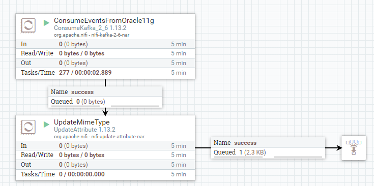

# Capturing & Streaming Oracle Database 11g changes into NiFi with Debezium Connector

## Conceptual CDC Architecture


## Running the stack with docker-compose
1. Dockerize and Run Oracle Database 11g XE
2. Setup REDO logs and LogMiner
3. Configure Kafka Connect based Debezium with Oracle Instant Libraries
4. Run `docker-compose.yml`
5. Deploy Debezium 1.3 Oracle Connector 
6. Insert test data to database
7. Record changes from NiFi

Following pre-requisite is required before running the stack
- Install [docker](https://docs.docker.com/engine/install/) and [docker-compose](https://docs.docker.com/compose/install/)
- Latest [Git](https://git-scm.com/) 

### Dockerize and Run Oracle Database 11g Express Edition (XE)

Since Oracle 11g XE is community edition, its free to download with Oracle Account. Please download from [Oracle Technology Network](http://www.oracle.com/technetwork/database/enterprise-edition/downloads/index.html) 

#### Get oracle-docker-image repository
```shell
git clone https://github.com/oracle/docker-images.git
```
#### Navigate to the Oracle database single instance directory, shown below:
```shell
cd docker-images/OracleDatabase/SingleInstance/dockerfiles
```
#### Build the oracle image

The downloaded installation file will be like this `oracle-xe-11.2.0-1.0.x86_64.rpm`
Copy the binary file to navigated directory from previous step and install
```shell
cp /home/ubuntu/oracle-xe-11.2.0-1.0.x86_64.rpm 11.2.0.2
./buildContainerImage.sh -v 11.2.0.2 -i -x
```

#### Running the container

Following shows how to run the oracle image. Make sure you want until you see `DATABASE IS READY` as it goes through series of configuration changes
```
docker run --name dbz_oracle --shm-size=1g -p 1521:1521 -e ORACLE_PWD=top_secret oracle/database:11.2.0.2-xe
```

### Setup REDO logs

Follow this [setup](https://github.com/debezium/oracle-vagrant-box/blob/master/REDOLOG_SETUP.md). To conclude, following steps are performed. Note that, I have used log multiplexing to increase recovery failure by keeping backup files.

```shell
select group#, bytes/1024/1024, status from v$log order by 1;

# resize group 4
alter database clear logfile group 4;
alter database drop logfile group 4;
alter database add logfile group 4 ('/u01/app/oracle/oradata/XE/redo04.log', '/u01/app/oracle/oradata/XE/redo04a.log') size 300M reuse;

# resize group 6
alter database clear logfile group 6;
alter database drop logfile group 6;
alter database add logfile group 6 ('/u01/app/oracle/oradata/XE/redo06.log', '/u01/app/oracle/oradata/XE/redo06a.log') size 300M reuse;

# switching of CURRENT status logfile to inactive (for group 5) 
alter system switch logfile;

# Wait until the ACTIVE status changes to INACTIVE (In my case, group 5 was ACTIVE from CURRENT status. This can take few minutes to approximately half hour
alter database clear logfile group 5;
alter database drop logfile group 5;
alter database add logfile group 5 ('/u01/app/oracle/oradata/XE/redo05.log', '/u01/app/oracle/oradata/XE/redo05a.log') size 300M reuse;

# additional redo logs group
alter database add logfile group 1 ('/u01/app/oracle/oradata/XE/redo01.log', '/u01/app/oracle/oradata/XE/redo01a.log') size 300M reuse;
alter database add logfile group 2 ('/u01/app/oracle/oradata/XE/redo02.log', '/u01/app/oracle/oradata/XE/redo02a.log') size 300M reuse;
alter database add logfile group 3 ('/u01/app/oracle/oradata/XE/redo03.log', '/u01/app/oracle/oradata/XE/redo03a.log') size 300M reuse;

```

After making above changes, your groups should like below


### Setup LogMiner (Database Configuration)

As Oracle 11g XE does not support XStream API, LogMiner is used and configured. Run the following command 
```shell
cat setup-logminer-11.sh | docker exec -i --user=oracle dbz_oracle bash
```

Also, we need to alter database supplemental logging all columns, this setup is needed as well
```shell
# connect to db as sysdba
docker exec -i dbz_oracle sqlplus sys/top_secret@//localhost:1521/XE as sysdba

# run following to alter database supplemental logs
SQL> ALTER DATABASE ADD SUPPLEMENTAL LOG DATA (ALL) COLUMNS;
```

### Running docker-compose stack

Before running the stack, you need to download [Oracle Instant Libraries](https://www.oracle.com/database/technologies/instant-client/linux-x86-64-downloads.html) and unzip into a directory `debezium-with-jdbc/oracle_instantclient`. This is done for building Kafka Connect image which needs `ojdbc8.jar` and `xstream.jar` into `/kafka/lib`

```shell
unzip instantclient-basic-linux.x64-21.1.0.0.0.zip debezium-with-jdbc/oracle_instantclient
```

Also insert test data so that you can right way see 'op: r' (read operation) change events in Kafka Consumer
```shell
cat debezium-with-oracle-jdbc/init/inventory.sql | docker exec -i dbz_oracle sqlplus debezium/dbz@//localhost:1521/XE
```
#### Run the stack

This spins up Zookeeper, Kafka, Kafka Connect in-flight image and NiFi 
```shell
export DEBEZIUM_VERSION=1.3
docker-compose up --build
```
### Deploy Debezium Oracle Connector

Verifying that all components and inter connectivity between them is working fine before you proceed further

#### Start Oracle Connector

Make sure you change `database.hostname` to HOSTNAME or IP of your oracle database container

```shell
curl -i -X POST -H "Accept:application/json" -H  "Content-Type:application/json" http://localhost:8083/connectors/ -d @register-oracle-logminer.json
```

Once deployed, the connector will run initial snapshotting, you can see that in logs.

### Consume change events in NiFi

You can download [sample-template](./consumekafka-oracle-cdc.xml) and upload to NiFi Canvas



ConsumeKakfa_2_6 Processor Configuration


Output FlowFile from ConsumeKafka_2_6 Processor


Thats it, whenever there is a change to `CUSTOMERS` table, our ConsumeKafKka processor will consume the change from topic `server1.DEBEZIUM.CUSTOMERS`.
